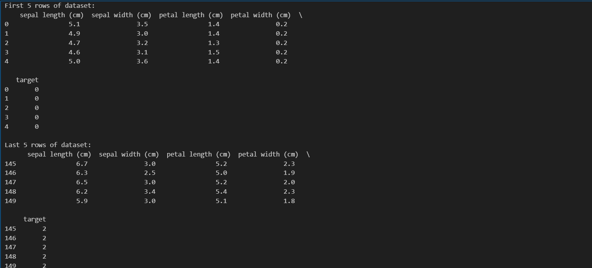
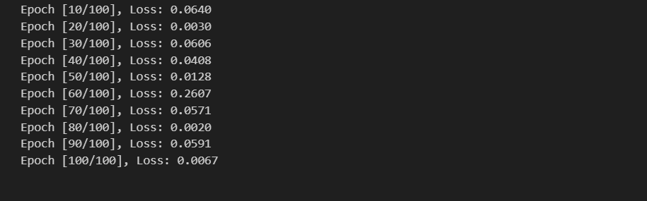
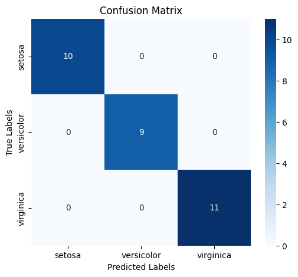
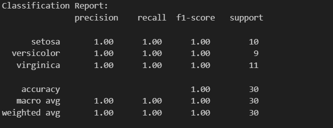
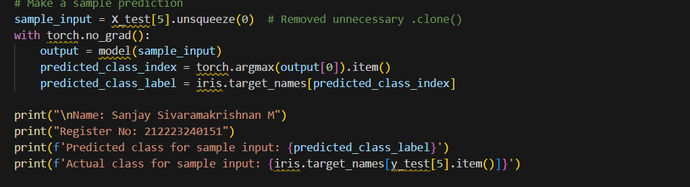
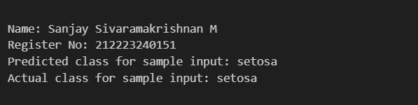

# Developing a Neural Network Classification Model

## AIM
To develop a neural network classification model for the given dataset.

## THEORY
The Iris dataset consists of 150 samples from three species of iris flowers (Iris setosa, Iris versicolor, and Iris virginica). Each sample has four features: sepal length, sepal width, petal length, and petal width. The goal is to build a neural network model that can classify a given iris flower into one of these three species based on the provided features.

## Neural Network Model
Include the neural network model diagram.

## DESIGN STEPS
### STEP 1: 
   Import required libraries (torch, sklearn, matplotlib, etc.)

### STEP 2: 
    Load the Iris dataset and split into train and test sets.

### STEP 3: 
    Convert numpy arrays into PyTorch tensors and create DataLoader.


### STEP 4: 
    Define a neural network model with input, hidden, and output layers.


### STEP 5: 
    Train the model with CrossEntropyLoss and Adam optimizer.


### STEP 6: 
    Evaluate using accuracy, confusion matrix, and classification report.


## PROGRAM
```
import torch
import torch.nn as nn
import torch.optim as optim
import torch.nn.functional as F
import pandas as pd
import numpy as np
from sklearn.model_selection import train_test_split
from sklearn.preprocessing import StandardScaler
from sklearn.metrics import accuracy_score, confusion_matrix, classification_report
from torch.utils.data import TensorDataset, DataLoader
import seaborn as sns
import matplotlib.pyplot as plt
from sklearn.datasets import load_iris
# Load Iris dataset
iris = load_iris()
X = iris.data  # Features
y = iris.target  # Labels (already numerical)
# Convert to DataFrame for easy inspection
df = pd.DataFrame(X, columns=iris.feature_names)
df['target'] = y
# Display first and last 5 rows
print("First 5 rows of dataset:\n", df.head())
print("\nLast 5 rows of dataset:\n", df.tail())
# Split dataset
X_train, X_test, y_train, y_test = train_test_split(X, y, test_size=0.2, random_state=42)
# Standardize features
scaler = StandardScaler()
X_train = scaler.fit_transform(X_train)
X_test = scaler.transform(X_test)
# Convert to PyTorch tensors
X_train = torch.tensor(X_train, dtype=torch.float32)
X_test = torch.tensor(X_test, dtype=torch.float32)
y_train = torch.tensor(y_train, dtype=torch.long)
y_test = torch.tensor(y_test, dtype=torch.long)
# Create DataLoader
train_dataset = TensorDataset(X_train, y_train)
test_dataset = TensorDataset(X_test, y_test)
train_loader = DataLoader(train_dataset, batch_size=16, shuffle=True)
test_loader = DataLoader(test_dataset, batch_size=16)
# Define Neural Network Model
class IrisClassifier(nn.Module):
    def __init__(self, input_size):
        super(IrisClassifier, self).__init__()
        self.l1 = nn.Linear(4, 16)    
        self.relu = nn.ReLU()
        self.l2 = nn.Linear(16, 3) 

    def forward(self, x):
        return self.l1(x)
x = np.random.rand(3, 2)

y = np.sum(x, axis=0, keepdims=True)
print(y)
y.shape
#+end_src
# Training function
def train_model(model, train_loader, criterion, optimizer, epochs):
        
        for epoch in range(epochs):
              for X,Y in train_loader:
                    output = model(X)
                    loss = criterion(output,Y)

                    optimizer.zero_grad()
                    loss.backward()
                    optimizer.step()

              if (epoch + 1) % 10 == 0:
                print(f'Epoch [{epoch + 1}/{epochs}], Loss: {loss.item():.4f}')

# Initialize model, loss function, and optimizer
model = IrisClassifier(3)
criterion = nn.CrossEntropyLoss()
optimizer = optim.Adam(model.parameters(),lr=0.01)
# Train the model
train_model(model, train_loader, criterion, optimizer, epochs=100)
# Evaluate the model
model.eval()
predictions, actuals = [], []
with torch.no_grad():
    for X_batch, y_batch in test_loader:
        outputs = model(X_batch)
        _, predicted = torch.max(outputs, 1)
        predictions.extend(predicted.numpy())
        actuals.extend(y_batch.numpy())
# Compute metrics
accuracy = accuracy_score(actuals, predictions)
conf_matrix = confusion_matrix(actuals, predictions)
class_report = classification_report(actuals, predictions, target_names=iris.target_names)

# Print details
print("\nName: ")
print("Register No: ")
print(f'Test Accuracy: {accuracy:.2f}%')
print("Confusion Matrix:\n", conf_matrix)
print("Classification Report:\n", class_report)

# Plot confusion matrix
plt.figure(figsize=(6, 5))
sns.heatmap(conf_matrix, annot=True, cmap='Blues', xticklabels=iris.target_names, yticklabels=iris.target_names, fmt='g')
plt.xlabel("Predicted Labels")
plt.ylabel("True Labels")
plt.title("Confusion Matrix")
plt.show()
# Make a sample prediction
sample_input = X_test[5].unsqueeze(0)  # Removed unnecessary .clone()
with torch.no_grad():
    output = model(sample_input)
    predicted_class_index = torch.argmax(output[0]).item()
    predicted_class_label = iris.target_names[predicted_class_index]

print("\nName: Sanjay Sivaramakrishnan M")
print("Register No: 212223240151")
print(f'Predicted class for sample input: {predicted_class_label}')
print(f'Actual class for sample input: {iris.target_names[y_test[5].item()]}')
```

### Name: Sanjay Sivaramakrishnan M

### Register Number: 212223240151

```python
class IrisClassifier(nn.Module):
    def __init__(self, input_size):
        super(IrisClassifier, self).__init__()
        #Include your code here

    def forward(self, x):
        #Include your code here


# Initialize the Model, Loss Function, and Optimizer

def train_model(model, train_loader, criterion, optimizer, epochs):
    #Include your code here

```

### Dataset Information


### OUTPUT


## Confusion Matrix


## Classification Report


### New Sample Data Prediction


## RESULT

